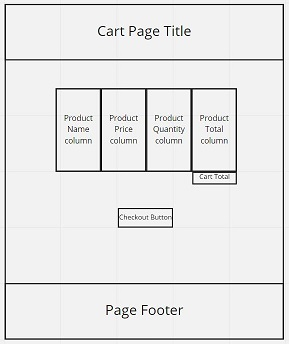

## Making a plan
1) Make a drawing of your app. Simple "wireframes"


Product Cards:


<hr>

2) Once you have a drawing, name the HTML elements you'll need to realize your vision
3) For each HTML element ask: Why do I need this?
4) Once we know _why_ we need each element, think about how to implement the "Why" as a "How"
3) For each HTML element ask: Why do I need this?
4) Once we know _why_ we need each element, think about how to implement the "Why" as a "How"


### Home Page:
    - h1 element for title of home page.
    - a element to link to products page.

### Products Page:
    - h1 element for title of products page
    - ul element to contain product cards.
    - li elements to model functions.
    - **Optional: a element to link to cart page.

### Product Cards:
    - h3 element for product title/name.
    - img element for product image.
    - p element for product description.
    - div to contain two additional p elements.
        - 2 x p elements, for category and price.
    - **Optional: button element to add item to cart

<hr>

5) Is there some state we need to initialize?

`let cartArray = []` for items place in carts
<hr>

6) Find all the 'events' (user clicks, form submit, etc) in your app. Ask one by one, "What happens when" for each of these events. Does any state change?

- **Optional: User clicks 'Add to Cart' button.
    - Current Goal: Alert(Product name)
    - Future Goal: Push product to cartArray/Cart page

<hr>


7) Think about how to validate each of your steps

`Console.log(*EVERYTHING*);`
<hr>

8) Consider your data model. What objects will you be using? What are the key/value pairs? What arrays do you need? What needs to live in local storage?

```javascript
const productsObj = [
    product1 = {
        id: 01,
        name: 'product-name',
        img: src('.assets/product-image.JPG'),
        description: 'Product description that is cool AF',
        category: 'product-category',
        price: number value
    },
    product2 = {
        id: 02,
        'etc..'
    },
    product3 = {},
    product4 = {},
    product5 = {},
    'etc..'
]
```
<hr>

<!-- 9) Consider what features _depend_ on what other features. Use this dependency logic to figure out what order to complete tasks. -->

[Image resources](https://www.stickpng.com/search?q=rubber%20duck&page=1)

<hr>
<hr>
<hr>

## Day 2 - Shopping Cart

1) Make a drawing of your app. Simple "wireframes"



<hr>

2) Once you have a drawing, name the HTML elements you'll need to realize your vision
3) For each HTML element ask: Why do I need this?
4) Once we know _why_ we need each element, think about how to implement the "Why" as a "How"
3) For each HTML element ask: Why do I need this?
4) Once we know _why_ we need each element, think about how to implement the "Why" as a "How"

### Carts Page:
    - Header element to contain page title.
        - h1 element for page title.
    - TH element to contain Table header data.
        - 4x TD for Product Name, Product Price, Product Quantity, Product Total
    - TBody element to contain Table body data.
        - Generated Elements per product in cart:
            - TR element to contain table row data.
            - 4 x TD elements to contain relavent data.
        - TR element for cart total data.
            - 3 x TD element left empty.
            - 1 TD element to contain cart total value.
                - Needs an ID so we can access and render data to it.
    - Footer element to contain page footer.
        - p element for footer content.

<hr>
5) Is there some state we need to initialize?

None yet. Pressumably a cart array that has objects containing item IDs and quantitys pushed to it, then the array itself can be pushed to local storage.

<hr>
6) Find all the 'events' (user clicks, form submit, etc) in your app. Ask one by one, "What happens when" for each of these events. Does any state change?

- **Optional: User clicks 'Check Out' button.
    - Current Goal: Alert(Product Total)
<hr>
7) Think about how to validate each of your steps

`Console.log(*EVERYTHING*);`
<hr>
8) Consider your data model. What objects will you be using? What are the key/value pairs? What arrays do you need? What needs to live in local storage?
    
    To start: 
```javascript
const cartArray = [
    {
        id: 1,
        quantity: 1
    },
    {
        id: 2,
        'etc..'
    },
    {},
    'etc..'
]
```
<hr>
9) Consider functions. What are the expected inputs and outputs? Are any of them linked, which should occur first?

- TDD findById Function
    TDD for a function that lives in /utils.js called findById. This function takes an array and an id, and returns the first item found that has an .id property that matches the passed in id. It can return null if no match is found.

    You might need expect.deepEqual to complete your test if you're comparing two objects.

- TDD calcItemTotal Function
    TDD for a function that lives in /utils.js called calcItemTotal. This function takes quantity and an amount and returns the total. Due to how JavaScript uses floating point numbers, you may need to round the result to two decimal places using: Math.round(amount * 100) / 100

- TDD DOM Render Function
    TDD for a function that lives in /shopping-cart/render-line-items.js. This function takes both a cart line item, and the corresponding product, and returns dom that matches your static html example:

        1. Copy html from the page
        2. You will need to remove extraneous whitespace. Don't worry, you can adjust the test as need
        3. Copy the cart line item data for the one that corresponds to the example, and either copy the product or use your findById function to locate the product and use as your input to your function
        4.Using the DOM API, create your static example programmatically using JavaScript. Start by creating the top level element (<tr> for the line item)
        5.Make the test pass! (Again, you may need to adjust html syntax - pay close attention to test details)