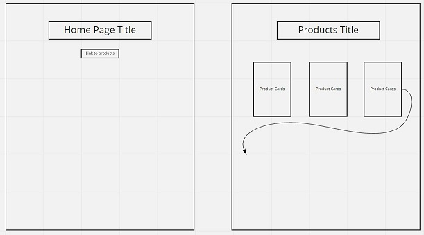
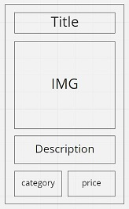

## Making a plan
1) Make a drawing of your app. Simple "wireframes"

Product Cards:

2) Once you have a drawing, name the HTML elements you'll need to realize your vision
3) For each HTML element ask: Why do I need this?
4) Once we know _why_ we need each element, think about how to implement the "Why" as a "How"
3) For each HTML element ask: Why do I need this?
4) Once we know _why_ we need each element, think about how to implement the "Why" as a "How"

### Home Page:
    - h1 element for title of home page.
    - a element to link to products page.

### Products Page:
    - h1 element for title of products page
    - ul element to contain product cards.
    - li elements to model functions.
    - **Optional: a element to link to cart page.

### Product Cards:
    - h3 element for product title/name.
    - img element for product image.
    - p element for product description.
    - div to contain two additional p elements.
        - 2 x p elements, for category and price.
    - **Optional: button element to add item to cart

5) Is there some state we need to initialize?

`let cartArray = []` for items place in carts

6) Find all the 'events' (user clicks, form submit, etc) in your app. Ask one by one, "What happens when" for each of these events. Does any state change?

- **Optional: User clicks 'Add to Cart' button.
    - Current Goal: Alert(Product name)
    - Future Goal: Push product to cartArray/Cart page

7) Think about how to validate each of your steps

`Console.log(*EVERYTHING*);`

<!-- 8) Consider your data model. What objects will you be using? What are the key/value pairs? What arrays do you need? What needs to live in local storage? -->
<!-- 9) Consider what features _depend_ on what other features. Use this dependency logic to figure out what order to complete tasks. -->

